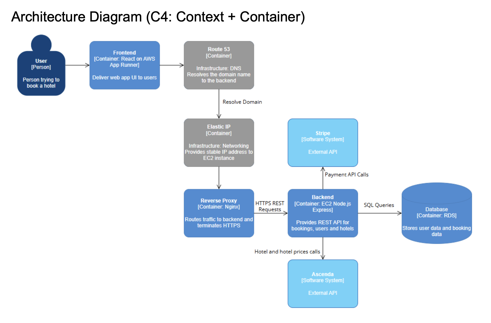

# Hotel Booking Platform

Full-stack hotel booking system with destination search, real-time pricing, Stripe payments, and interactive map clustering.

## 📁 Repositories
- **Frontend:** [github.com/how2fps/esc-booking-frontend](https://github.com/how2fps/esc-booking-frontend)  
- **Backend:** [github.com/how2fps/esc-booking-backend](https://github.com/how2fps/esc-booking-backend)

## Tech Stack
| Layer | Technologies |
|-------|--------------|
| Frontend | React, TypeScript, Vite |
| Backend | Node.js, Express, TypeScript |
| Database | MySQL (AWS RDS) |
| Infrastructure | AWS EC2, Route 53, nginx, Docker |
| External APIs | Stripe (payments), Ascenda (hotel data) |

## Architecture


**System deployed on AWS:**
- React frontend on AWS App Runner
- Node.js/Express backend on EC2
- MySQL on RDS
- nginx reverse proxy with HTTPS/TLS
- Stripe & Accenda API integrations

## Features
- Destination search with BK-tree typo correction algorithm
- Hotel listing with filters, sorting, pagination
- Interactive map with marker clustering and click-to-book
- Secure checkout with Stripe integration
- User authentication with session management
- Profile management with cascading account deletion

## Running Locally
```bash
# Frontend
npm install
npm run dev

# Backend
npm install
npm run dev
```
